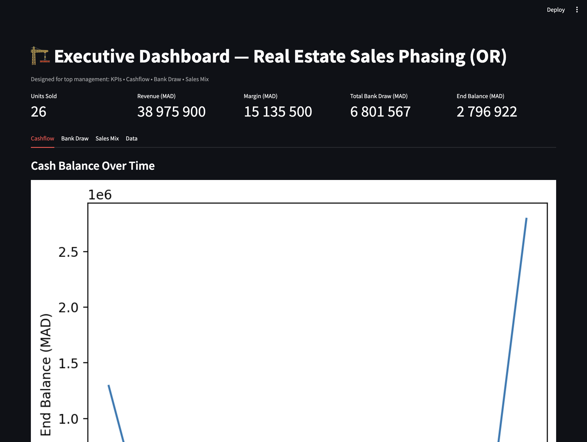

# Create a README.md file with placeholder for screenshot
readme_content = """
# 🏗️ Real Estate Sales Optimization using Operations Research (OR) & Python

This project demonstrates how mathematical optimization (Operations Research) can improve real estate development decisions by optimizing the timing of unit sales to:

✅ Reduce bank financing needs  
✅ Maintain a positive cash balance  
✅ Increase profitability and reduce financial risk  
✅ Provide an executive-friendly dashboard for decision-makers

---

## 🎯 1. Project Objective

In real estate development, units are often sold based on intuition (e.g., selling premium units first).  
This project proves that using **data + optimization + cashflow modeling**, we can:

- Determine **when each unit should be sold**
- Delay bank financing as much as possible (minimizing interest)
- Ensure cashflow remains positive throughout construction
- Improve return on investment using an **optimization model (MILP)**

---

## 🧠 2. Mathematical Model (Operations Research)

### ✅ **Decision Variables**
| Variable | Meaning |
|----------|---------|
| \(x_{l,m}\) | 1 if lot `l` is sold in month `m`, else 0 |
| \(draw_m\) | Bank financing used in month `m` |
| \(balance_m\) | Cash balance at the end of month `m` |

---

### ✅ **Objective Function**
Minimize total bank financing used across the project:

\[
\min \sum_{m=1}^{T} draw_m
\]

---

### ✅ **Constraints**
1. **Each unit can be sold at most once**  
\[
\sum_{m=1}^{T} x_{l,m} \le 1 \quad \forall l
\]

2. **No sale before construction allows it**  
\[
x_{l,m} = 0 \quad \text{if } m < earliest\_month(l)
\]

3. **Sales team capacity per month**  
\[
\sum_{l=1}^{N} x_{l,m} \le Cap \quad \forall m
\]

4. **Cashflow equation**  
\[
balance_m = balance_{m-1} + \sum_l (price_l \cdot x_{l,m})
- (constructionCost_m + \sum_l cost_l \cdot x_{l,m}) + draw_m
\]

5. **No negative cash balance**  
\[
balance_m \ge 0 \quad \forall m
\]

---

## 📊 3. Dashboard Preview (Screenshot)

This image shows the optimized sales schedule and cashflow visualization in Streamlit.

---

## ✅ 4. Example Results & Interpretation

| **KPI**              | **Value (Example)** |
|----------------------|---------------------|
| Units Sold           | 26                  |
| Total Revenue        | 38,975,900 MAD      |
| Total Margin         | 15,135,500 MAD      |
| Total Bank Draw      | 6,801,567 MAD       |
| Final Balance        | 2,796,922 MAD       |

### 💡 Interpretation:

- The optimized sales sequence **reduces bank financing needs**.  
- High-value lots are sometimes **sold later**, to maintain pricing power instead of selling them first.  
- Cashflow remains **positive every month**, which means no liquidity crisis.  
- **Optimization outperforms intuition-based sales strategies.**

---

## 💼 5. Business Value

| **Traditional Method**            | **Optimized (This Project)**         |
|----------------------------------|----------------------------------------|
| Sell premium units first         | Sell units based on cashflow impact   |
| Early heavy bank borrowing       | Delay financing → lower interest      |
| Decisions based on intuition     | Decisions based on data & math        |
| No treasury anticipation         | Cashflow simulation + OR constraints  |

---

